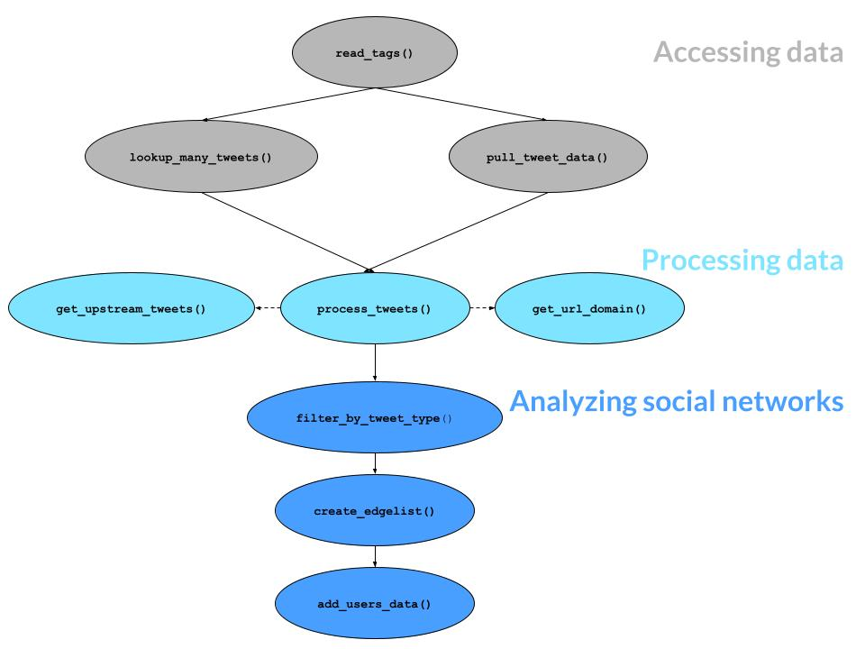

<!-- README.md is generated from README.Rmd. Please edit that file -->

# tidytags <a href='https://docs.ropensci.org/tidytags/'></a>

##### *Importing and Analyzing ‘Twitter’ Data Collected with ‘Twitter Archiving Google Sheets’*

<!-- badges: start -->
<!-- For additional badges for CRAN, see https://docs.ropensci.org/drake/ -->
<table class="table">
<thead>
<tr class="header">
<th align="left">
Release
</th>
<th align="left">
Usage
</th>
<th align="left">
Development
</th>
<th align="left">
Checks
</th>
</tr>
</thead>
<tbody>
<tr class="odd">
<td align="left">
<a href="https://cran.r-project.org/package=tidytags"></a>
</td>
<td align="left">
<a href="https://choosealicense.com/licenses/mit/"></a>
</td>
<td align="left">
<a href="https://www.repostatus.org/#active/"></a>
</td>
<td align="left">
<a href="https://cran.r-project.org/web/checks/check_results_dplyr.html"></a>
</td>
</tr>
<tr class="even">
<td align="left">
<a href="https://cran.r-project.org/"></a>
</td>
<td align="left">
<a href="https://cran.r-project.org/package=tidytags"></a>
</td>
<td align="left">
<a href="https://lifecycle.r-lib.org/articles/stages.html#stable"></a>
</td>
<td align="left">
<a href="https://github.com/ropensci/tidytags/actions/"></a>
</td>
</tr>
<tr class="odd">
<td align="left">
<a href="https://github.com/ropensci/software-review/issues/382"></a>
</td>
<td align="left">
<a href="https://cran.r-project.org/package=tidytags"></a>
</td>
<td align="left">
<a href="https://github.com/ropensci/tidytags/commits/main"></a>
</td>
<td align="left">
<a href="https://app.codecov.io/gh/ropensci/tidytags?branch=main"></a>
</td>
</tr>
</tbody>
</table>

## <!-- badges: end -->

## Overview

The purpose of **tidytags** is to make the collection of Twitter data
more accessible and robust. **tidytags** retrieves tweet data collected
by a [Twitter Archiving Google Sheet
(TAGS)](https://tags.hawksey.info/), gets additional metadata from
Twitter via the **[rtweet](https://docs.ropensci.org/rtweet/)** R
package, and provides additional functions to facilitate a systematic
yet flexible analyses of data from Twitter. TAGS is based on Google
spreadsheets. A TAGS tracker continuously collects tweets from Twitter,
based on predefined search criteria and collection frequency.

In short, **tidytags** first uses TAGS to easily collect tweet ID
numbers and then uses the R package **rtweet** to re-query the Twitter
API to collect additional metadata. **tidytags** also introduces
functions developed to facilitate systematic yet flexible analyses of
data from Twitter.

Two vignettes illustrate the setup and use of the package:

- [Getting started with
  tidytags](https://docs.ropensci.org/tidytags/articles/setup.html)
  (`vignette("setup", package = "tidytags")`)
- [Using tidytags with a conference
  hashtag](https://docs.ropensci.org/tidytags/articles/tidytags-with-conf-hashtags.html)
  (`vignette("tidytags-with-conf-hashtags", package = "tidytags")`)

------------------------------------------------------------------------

## Installation

To get the current released version of **tidytags** from CRAN:

``` r
install.packages("tidytags")
```

Or you can install the development version of **tidytags** from GitHub:

``` r
install.packages("tidytags", repos = "https://ropensci.r-universe.dev")
```

Once installed, use the `library()` function load **tidytags**:

``` r
library(tidytags)
```

------------------------------------------------------------------------

## Setup

For help with initial **tidytags** setup, see the [Getting started with
tidytags](https://docs.ropensci.org/tidytags/articles/setup.html)
vignette (`vignette("setup", package = "tidytags")`). Specifically, this
guide offers help for two key tasks:

1.  Making sure your TAGS tracker can be accessed
2.  Getting and storing Twitter API tokens

------------------------------------------------------------------------

## Usage

To test the **tidytags** package, you can use an openly shared TAGS
tracker that has been collecting tweets associated with the AECT 2019
since September 30, 2019. This is the same TAGS tracker used in the
[Using tidytags with a conference hashtag
vignette](https://docs.ropensci.org/tidytags/articles/tidytags-with-conf-hashtags.html)
(`vignette("tidytags-with-conf-hashtags", package = "tidytags")`).

------------------------------------------------------------------------

## Core Functions

### read_tags()

At its most basic level, **tidytags** allows you to import data from a
[Twitter Archiving Google Sheet](https://tags.hawksey.info/) (TAGS) into
R. This is done with the
**[googlesheets4](https://CRAN.R-project.org/package=googlesheets4)** R
package. One requirement for using the **googlesheets4** package is that
your TAGS tracker has been “published to the web.” See the [Getting
started with
tidytags](https://docs.ropensci.org/tidytags/articles/setup.html)
vignette (`vignette("setup", package = "tidytags")`), **Key Task \#1**,
if you need help with this.

Once a TAGS tracker has been published to the web, you can import the
TAGS archive into R using `read_tags()`.

``` r
example_tags <- "18clYlQeJOc6W5QRuSlJ6_v3snqKJImFhU42bRkM_OX8"
tags_data <- read_tags(example_tags)
head(tags_data)
#> # A tibble: 6 × 18
#>   id_str       from_…¹ text  creat…² time                geo_c…³ user_…⁴ in_re…⁵
#>   <chr>        <chr>   <chr> <chr>   <dttm>              <chr>   <lgl>   <chr>  
#> 1 12519543127… Harrie… "RT … Sun Ap… 2020-04-19 20:22:23 <NA>    NA      <NA>   
#> 2 12480641632… Patric… "RT … Thu Ap… 2020-04-09 02:44:19 <NA>    NA      <NA>   
#> 3 12342069467… ELTAug… "RT … Sun Ma… 2020-03-01 20:00:40 <NA>    NA      <NA>   
#> 4 12294053501… gsa_ae… "RT … Mon Fe… 2020-02-17 14:00:50 <NA>    NA      <NA>   
#> 5 12276522438… fcis_iu "Giv… Wed Fe… 2020-02-12 17:54:38 <NA>    NA      <NA>   
#> 6 12255051874… Stauff… "RT … Thu Fe… 2020-02-06 19:43:00 <NA>    NA      <NA>   
#> # … with 10 more variables: in_reply_to_screen_name <chr>,
#> #   from_user_id_str <chr>, in_reply_to_status_id_str <chr>, source <chr>,
#> #   profile_image_url <chr>, user_followers_count <dbl>,
#> #   user_friends_count <dbl>, user_location <chr>, status_url <chr>,
#> #   entities_str <chr>, and abbreviated variable names ¹​from_user, ²​created_at,
#> #   ³​geo_coordinates, ⁴​user_lang, ⁵​in_reply_to_user_id_str
```

### pull_tweet_data()

With a TAGS archive imported into R, **tidytags** allows you to gather
quite a bit more information related to the collected tweets with the
`pull_tweet_data()` function. This function uses the **[rtweet
package](https://docs.ropensci.org/rtweet/)** (via
`rtweet::lookup_tweets()`) to query the Twitter API.

This process requires Twitter API keys associated with an approved
Twitter developer account. See the [Getting started with
tidytags](https://docs.ropensci.org/tidytags/articles/setup.html)
vignette (`vignette("setup", package = "tidytags")`), **Key Task \#2**,
if you need help with this.

``` r
app <- rtweet::rtweet_app(bearer_token = Sys.getenv("TWITTER_BEARER_TOKEN"))
rtweet::auth_as(app)

expanded_metadata <- pull_tweet_data(tags_data, n = 10)
expanded_metadata
#>            created_at           id              id_str
#> 1 2020-04-19 15:22:23 1.251954e+18 1251954312772812801
#> 2 2020-02-17 09:00:51 1.229405e+18 1229405350178127872
#> 3 2020-02-05 14:23:27 1.225138e+18 1225137879921385472
#> 4 2020-02-05 13:21:36 1.225122e+18 1225122317849657345
#> 5 2020-01-21 18:07:15 1.219758e+18 1219758386436165633
#> 6 2020-01-19 18:46:51 1.219044e+18 1219043574555299840
#>                                                                                                                                                                                                                                                                           text
#> 1                                                                                                                                 RT @RoutledgeEd: Congrats to authors Joseph Rene Corbeil, Maria Elena Corbeil, and (not pictured) Badrul Khan, who received the Outstanding…
#> 2                                                                                                                                 RT @tadousay: Many thanks to @AECTTechTrends for supporting our @gsa_aect with the Grad Member Musings column! The latest guest author is #…
#> 3                                                                                                                                 RT @tadousay: Many thanks to @AECTTechTrends for supporting our @gsa_aect with the Grad Member Musings column! The latest guest author is #…
#> 4 Many thanks to @AECTTechTrends for supporting our @gsa_aect with the Grad Member Musings column! The latest guest author is #uidaho's Ken Cox, a first year doc student in our C&amp;I program and a member of my #UISTEMEdRG. https://t.co/8MuP9Mza8f #aect #aect20 #aect19
#> 5                                                                                                                                 RT @AECT: The #AECT19 convention proceedings are available! The papers published in these volumes were presented at the annual AECT Convent…
#> 6                                                                                                                                 RT @AECT: The #AECT19 convention proceedings are available! The papers published in these volumes were presented at the annual AECT Convent…
#>                                                                                                                                                                                                                                                                      full_text
#> 1                                                                                                                                 RT @RoutledgeEd: Congrats to authors Joseph Rene Corbeil, Maria Elena Corbeil, and (not pictured) Badrul Khan, who received the Outstanding…
#> 2                                                                                                                                 RT @tadousay: Many thanks to @AECTTechTrends for supporting our @gsa_aect with the Grad Member Musings column! The latest guest author is #…
#> 3                                                                                                                                 RT @tadousay: Many thanks to @AECTTechTrends for supporting our @gsa_aect with the Grad Member Musings column! The latest guest author is #…
#> 4 Many thanks to @AECTTechTrends for supporting our @gsa_aect with the Grad Member Musings column! The latest guest author is #uidaho's Ken Cox, a first year doc student in our C&amp;I program and a member of my #UISTEMEdRG. https://t.co/8MuP9Mza8f #aect #aect20 #aect19
#> 5                                                                                                                                 RT @AECT: The #AECT19 convention proceedings are available! The papers published in these volumes were presented at the annual AECT Convent…
#> 6                                                                                                                                 RT @AECT: The #AECT19 convention proceedings are available! The papers published in these volumes were presented at the annual AECT Convent…
#>   truncated
#> 1     FALSE
#> 2     FALSE
#> 3     FALSE
#> 4     FALSE
#> 5     FALSE
#> 6     FALSE
#>                                                                                                                                                                                                                                                                                                                                              entities
#> 1                                                                                                                                                                                                                                               NA, NA, NA, NA, RoutledgeEd, Routledge Education Books, 27606068, 27606068, 3, 15, NA, NA, NA, NA, NA
#> 2                                                                                                                   NA, NA, NA, NA, tadousay, AECTTechTrends, gsa_aect, Dr. Tonia A. Dousay, TechTrends Editor, AECT GSA, 14215524, 804807943, 922536306437181440, 14215524, 804807943, 922536306437181440, 3, 29, 64, 12, 44, 73, NA, NA, NA, NA, NA
#> 3                                                                                                                   NA, NA, NA, NA, tadousay, AECTTechTrends, gsa_aect, Dr. Tonia A. Dousay, TechTrends Editor, AECT GSA, 14215524, 804807943, 922536306437181440, 14215524, 804807943, 922536306437181440, 3, 29, 64, 12, 44, 73, NA, NA, NA, NA, NA
#> 4 uidaho, UISTEMEdRG, aect, aect20, aect19, 124, 131, 210, 221, 247, 252, 253, 260, 261, 268, NA, NA, AECTTechTrends, gsa_aect, TechTrends Editor, AECT GSA, 804807943, 922536306437181440, 804807943, 922536306437181440, 15, 50, 30, 59, https://t.co/8MuP9Mza8f, https://doi.org/10.1007/s11528-020-00477-5, doi.org/10.1007/s11528…, 223, 246, NA
#> 5                                                                                                                                                                                                                                                                AECT19, 14, 21, NA, NA, AECT, ✵ AECT ✵, 12030342, 12030342, 3, 8, NA, NA, NA, NA, NA
#> 6                                                                                                                                                                                                                                                                AECT19, 14, 21, NA, NA, AECT, ✵ AECT ✵, 12030342, 12030342, 3, 8, NA, NA, NA, NA, NA
#>                                                                                 source
#> 1              <a href="https://mobile.twitter.com" rel="nofollow">Twitter Web App</a>
#> 2  <a href="https://about.twitter.com/products/tweetdeck" rel="nofollow">TweetDeck</a>
#> 3 <a href="http://twitter.com/download/android" rel="nofollow">Twitter for Android</a>
#> 4  <a href="https://about.twitter.com/products/tweetdeck" rel="nofollow">TweetDeck</a>
#> 5  <a href="https://about.twitter.com/products/tweetdeck" rel="nofollow">TweetDeck</a>
#> 6              <a href="https://mobile.twitter.com" rel="nofollow">Twitter Web App</a>
#>   in_reply_to_status_id in_reply_to_status_id_str in_reply_to_user_id
#> 1                    NA                        NA                  NA
#> 2                    NA                        NA                  NA
#> 3                    NA                        NA                  NA
#> 4                    NA                        NA                  NA
#> 5                    NA                        NA                  NA
#> 6                    NA                        NA                  NA
#>   in_reply_to_user_id_str in_reply_to_screen_name  geo coordinates
#> 1                      NA                      NA NULL  NA, NA, NA
#> 2                      NA                      NA NULL  NA, NA, NA
#> 3                      NA                      NA NULL  NA, NA, NA
#> 4                      NA                      NA NULL  NA, NA, NA
#> 5                      NA                      NA NULL  NA, NA, NA
#> 6                      NA                      NA NULL  NA, NA, NA
#>                        place contributors is_quote_status retweet_count
#> 1 NA, NA, NA, NA, NA, NA, NA           NA           FALSE             4
#> 2 NA, NA, NA, NA, NA, NA, NA           NA           FALSE             2
#> 3 NA, NA, NA, NA, NA, NA, NA           NA           FALSE             2
#> 4 NA, NA, NA, NA, NA, NA, NA           NA           FALSE             2
#> 5 NA, NA, NA, NA, NA, NA, NA           NA           FALSE             9
#> 6 NA, NA, NA, NA, NA, NA, NA           NA           FALSE             9
#>   favorite_count favorited favorited_by retweeted scopes lang
#> 1              0     FALSE           NA     FALSE     NA   en
#> 2              0     FALSE           NA     FALSE     NA   en
#> 3              0     FALSE           NA     FALSE     NA   en
#> 4              7     FALSE           NA     FALSE     NA   en
#> 5              0     FALSE           NA     FALSE     NA   en
#> 6              0     FALSE           NA     FALSE     NA   en
#>   possibly_sensitive display_text_width display_text_range
#> 1                 NA                 NA                140
#> 2                 NA                 NA                140
#> 3                 NA                 NA                140
#> 4              FALSE                 NA                268
#> 5                 NA                 NA                140
#> 6                 NA                 NA                140
#>                                                                                                                                                                                                                                                                                                                                                                                                                                                                                                                                                                                                                                                                                                                                                                                                                                                                                                                                                                                                                                                                                                                                                                                                                                                                                                                                                                                                                                                                                                                                                                                                                                                                                                                                                                                                                                                                                                                                                                                                                                                                                                                                                                                                                                     retweeted_status
#> 1 Wed Oct 23 21:58:17 +0000 2019, 1187126122376392704, 1187126122376392704, Congrats to authors Joseph Rene Corbeil, Maria Elena Corbeil, and (not pictured) Badrul Khan, who received the Outstanding Book Award from #AECT2019’s Culture, Learning, and Technology division — a global treatment of #learninganalytics and #educationaldatamining. https://t.co/aG1kf7a5ew, FALSE, 0, 264, AECT2019, learninganalytics, educationaldatamining, 139, 148, 218, 236, 241, 263, 1187126100159164416, 1187126100159164416, 265, 288, http://pbs.twimg.com/media/EHmE5f-U8AA6_mM.jpg, https://pbs.twimg.com/media/EHmE5f-U8AA6_mM.jpg, https://t.co/aG1kf7a5ew, pic.twitter.com/aG1kf7a5ew, https://twitter.com/RoutledgeEd/status/1187126122376392704/photo/1, photo, 150, 150, crop, 1536, 2048, fit, 900, 1200, fit, 510, 680, fit, 1187126100159164416, 1187126100159164416, 265, 288, http://pbs.twimg.com/media/EHmE5f-U8AA6_mM.jpg, https://pbs.twimg.com/media/EHmE5f-U8AA6_mM.jpg, https://t.co/aG1kf7a5ew, pic.twitter.com/aG1kf7a5ew, https://twitter.com/RoutledgeEd/status/1187126122376392704/photo/1, photo, 150, 150, crop, 1536, 2048, fit, 900, 1200, fit, 510, 680, fit, NA, <a href="http://twitter.com/download/iphone" rel="nofollow">Twitter for iPhone</a>, NA, NA, NA, NA, NA, 27606068, 27606068, Routledge Education Books, RoutledgeEd, Global, Supporting educators, teachers, scholars and students with informative and practical books based on leading research and classroom practice., http://t.co/j4LZK9ypti, http://t.co/j4LZK9ypti, http://www.routledge.com/education, routledge.com/education, 0, 22, FALSE, 13912, 3276, 233, Mon Mar 30 08:33:32 +0000 2009, 2785, NA, NA, TRUE, FALSE, 10327, NA, FALSE, FALSE, FALSE, 6A9ADA, http://abs.twimg.com/images/themes/theme15/bg.png, https://abs.twimg.com/images/themes/theme15/bg.png, FALSE, http://pbs.twimg.com/profile_images/461891534913167362/Uo2i4Z3P_normal.jpeg, https://pbs.twimg.com/profile_images/461891534913167362/Uo2i4Z3P_normal.jpeg, https://pbs.twimg.com/profile_banners/27606068/1629726175, NA, NA, 6A9ADA, FFFFFF, C0DFEC, 333333, TRUE, FALSE, FALSE, FALSE, NA, NA, NA, none, NA, NA, NA, NA, FALSE, 4, 5, FALSE, FALSE, FALSE, en
#> 2                                                                                                                                                                                                                                                                                                                                                                                                                                                                    Wed Feb 05 18:21:36 +0000 2020, 1225122317849657344, 1225122317849657345, Many thanks to @AECTTechTrends for supporting our @gsa_aect with the Grad Member Musings column! The latest guest author is #uidaho's Ken Cox, a first year doc student in our C&amp;I program and a member of my #UISTEMEdRG. https://t.co/8MuP9Mza8f #aect #aect20 #aect19, FALSE, 0, 268, uidaho, UISTEMEdRG, aect, aect20, aect19, 124, 131, 210, 221, 247, 252, 253, 260, 261, 268, AECTTechTrends, gsa_aect, TechTrends Editor, AECT GSA, 804807943, 922536306437181440, 804807943, 922536306437181440, 15, 30, 50, 59, https://t.co/8MuP9Mza8f, https://doi.org/10.1007/s11528-020-00477-5, doi.org/10.1007/s11528…, 223, 246, <a href="https://about.twitter.com/products/tweetdeck" rel="nofollow">TweetDeck</a>, NA, NA, NA, NA, NA, 14215524, 14215524, Dr. Tonia A. Dousay, tadousay, Anchorage, AK, ❖ @UAAnchorage Professor ⋄ Dean of #UAASOE ⋄ @TAMU BS '98 MS '00 ⋄ @UniversityofGA PhD '13 ⋄ #disted ⋄ #edtech ⋄ #teachered ⋄ #instructionaldesign ❖, https://t.co/ze9wrqUbH4, https://t.co/ze9wrqUbH4, https://brill.com/view/title/63987, brill.com/view/title/639…, 0, 23, FALSE, 2232, 1328, 176, Tue Mar 25 13:56:07 +0000 2008, 4269, NA, NA, TRUE, FALSE, 12277, NA, FALSE, FALSE, FALSE, 000000, http://abs.twimg.com/images/themes/theme9/bg.gif, https://abs.twimg.com/images/themes/theme9/bg.gif, FALSE, http://pbs.twimg.com/profile_images/1593000038036541440/uS2C5ATq_normal.jpg, https://pbs.twimg.com/profile_images/1593000038036541440/uS2C5ATq_normal.jpg, https://pbs.twimg.com/profile_banners/14215524/1664215281, NA, NA, FAB81E, 000000, 000000, 000000, FALSE, TRUE, FALSE, FALSE, NA, NA, NA, none, NA, NA, NA, NA, FALSE, 2, 7, FALSE, FALSE, FALSE, en
#> 3                                                                                                                                                                                                                                                                                                                                                                                                                                                                    Wed Feb 05 18:21:36 +0000 2020, 1225122317849657344, 1225122317849657345, Many thanks to @AECTTechTrends for supporting our @gsa_aect with the Grad Member Musings column! The latest guest author is #uidaho's Ken Cox, a first year doc student in our C&amp;I program and a member of my #UISTEMEdRG. https://t.co/8MuP9Mza8f #aect #aect20 #aect19, FALSE, 0, 268, uidaho, UISTEMEdRG, aect, aect20, aect19, 124, 131, 210, 221, 247, 252, 253, 260, 261, 268, AECTTechTrends, gsa_aect, TechTrends Editor, AECT GSA, 804807943, 922536306437181440, 804807943, 922536306437181440, 15, 30, 50, 59, https://t.co/8MuP9Mza8f, https://doi.org/10.1007/s11528-020-00477-5, doi.org/10.1007/s11528…, 223, 246, <a href="https://about.twitter.com/products/tweetdeck" rel="nofollow">TweetDeck</a>, NA, NA, NA, NA, NA, 14215524, 14215524, Dr. Tonia A. Dousay, tadousay, Anchorage, AK, ❖ @UAAnchorage Professor ⋄ Dean of #UAASOE ⋄ @TAMU BS '98 MS '00 ⋄ @UniversityofGA PhD '13 ⋄ #disted ⋄ #edtech ⋄ #teachered ⋄ #instructionaldesign ❖, https://t.co/ze9wrqUbH4, https://t.co/ze9wrqUbH4, https://brill.com/view/title/63987, brill.com/view/title/639…, 0, 23, FALSE, 2232, 1328, 176, Tue Mar 25 13:56:07 +0000 2008, 4269, NA, NA, TRUE, FALSE, 12277, NA, FALSE, FALSE, FALSE, 000000, http://abs.twimg.com/images/themes/theme9/bg.gif, https://abs.twimg.com/images/themes/theme9/bg.gif, FALSE, http://pbs.twimg.com/profile_images/1593000038036541440/uS2C5ATq_normal.jpg, https://pbs.twimg.com/profile_images/1593000038036541440/uS2C5ATq_normal.jpg, https://pbs.twimg.com/profile_banners/14215524/1664215281, NA, NA, FAB81E, 000000, 000000, 000000, FALSE, TRUE, FALSE, FALSE, NA, NA, NA, none, NA, NA, NA, NA, FALSE, 2, 7, FALSE, FALSE, FALSE, en
#> 4                                                                                                                                                                                                                                                                                                                                                                                                                                                                                                                                                                                                                                                                                                                                                                                                                                                                                                                                                                                                                                                                                                                                                                                                                                                                                                                                                                                                                                                                                                                                                                                                                                                                                                                                                                                                                                                                                                                                                                                 NA, NA, NA, NA, NA, NA, NA, NA, NA, NA, NA, NA, NA, NA, NA, NA, NA, NA, NA, NA, NA, NA, NA, NA, NA, NA, NA, NA, NA, NA, NA, NA, NA, NA, NA, NA, NA, NA, NA, NA, NA, NA, NA, NA, NA, NA, NA, NA, NA, NA, NA, NA, NA, NA, NA, NA, NA, NA, NA, NA, NA, NA, NA, NA, NA
#> 5                                                                                                                                 Sat Jan 18 15:00:08 +0000 2020, 1218548635333545984, 1218548635333545984, The #AECT19 convention proceedings are available! The papers published in these volumes were presented at the annual AECT Convention in Las Vegas last October. https://t.co/YWd4W72eEn https://t.co/gGnVfbJ7vu, FALSE, 0, 183, AECT19, 4, 11, https://t.co/YWd4W72eEn, http://bit.ly/AECT19proceedings, bit.ly/AECT19proceedi…, 160, 183, 1218548626764587008, 1218548626764587008, 184, 207, http://pbs.twimg.com/media/EOknhRfX4AAM1M2.jpg, https://pbs.twimg.com/media/EOknhRfX4AAM1M2.jpg, https://t.co/gGnVfbJ7vu, pic.twitter.com/gGnVfbJ7vu, https://twitter.com/AECT/status/1218548635333545984/photo/1, photo, 150, 150, crop, 1200, 628, fit, 680, 356, fit, 1200, 628, fit, 1218548626764587008, 1218548626764587008, 184, 207, http://pbs.twimg.com/media/EOknhRfX4AAM1M2.jpg, https://pbs.twimg.com/media/EOknhRfX4AAM1M2.jpg, https://t.co/gGnVfbJ7vu, pic.twitter.com/gGnVfbJ7vu, https://twitter.com/AECT/status/1218548635333545984/photo/1, photo, 150, 150, crop, 1200, 628, fit, 680, 356, fit, 1200, 628, fit, NA, <a href="https://mobile.twitter.com" rel="nofollow">Twitter Web App</a>, NA, NA, NA, NA, NA, 12030342, 12030342, ✵ AECT ✵, AECT, Worldwide, [Association for Educational Communications & Technology] Supporting #educators & #professionals dedicated to improving #instruction through #technology., https://t.co/s2f9IMQQQ6, https://t.co/s2f9IMQQQ6, http://aect.org, aect.org, 0, 23, FALSE, 4807, 567, 122, Wed Jan 09 15:38:18 +0000 2008, 3927, NA, NA, TRUE, FALSE, 3513, NA, FALSE, FALSE, FALSE, C0DEED, http://abs.twimg.com/images/themes/theme1/bg.png, https://abs.twimg.com/images/themes/theme1/bg.png, FALSE, http://pbs.twimg.com/profile_images/1057649830879748096/-gzHp1_5_normal.jpg, https://pbs.twimg.com/profile_images/1057649830879748096/-gzHp1_5_normal.jpg, https://pbs.twimg.com/profile_banners/12030342/1673302715, NA, NA, 1DA1F2, C0DEED, DDEEF6, 333333, TRUE, FALSE, TRUE, FALSE, NA, NA, NA, none, NA, NA, NA, NA, FALSE, 9, 21, FALSE, FALSE, FALSE, en
#> 6                                                                                                                                 Sat Jan 18 15:00:08 +0000 2020, 1218548635333545984, 1218548635333545984, The #AECT19 convention proceedings are available! The papers published in these volumes were presented at the annual AECT Convention in Las Vegas last October. https://t.co/YWd4W72eEn https://t.co/gGnVfbJ7vu, FALSE, 0, 183, AECT19, 4, 11, https://t.co/YWd4W72eEn, http://bit.ly/AECT19proceedings, bit.ly/AECT19proceedi…, 160, 183, 1218548626764587008, 1218548626764587008, 184, 207, http://pbs.twimg.com/media/EOknhRfX4AAM1M2.jpg, https://pbs.twimg.com/media/EOknhRfX4AAM1M2.jpg, https://t.co/gGnVfbJ7vu, pic.twitter.com/gGnVfbJ7vu, https://twitter.com/AECT/status/1218548635333545984/photo/1, photo, 150, 150, crop, 1200, 628, fit, 680, 356, fit, 1200, 628, fit, 1218548626764587008, 1218548626764587008, 184, 207, http://pbs.twimg.com/media/EOknhRfX4AAM1M2.jpg, https://pbs.twimg.com/media/EOknhRfX4AAM1M2.jpg, https://t.co/gGnVfbJ7vu, pic.twitter.com/gGnVfbJ7vu, https://twitter.com/AECT/status/1218548635333545984/photo/1, photo, 150, 150, crop, 1200, 628, fit, 680, 356, fit, 1200, 628, fit, NA, <a href="https://mobile.twitter.com" rel="nofollow">Twitter Web App</a>, NA, NA, NA, NA, NA, 12030342, 12030342, ✵ AECT ✵, AECT, Worldwide, [Association for Educational Communications & Technology] Supporting #educators & #professionals dedicated to improving #instruction through #technology., https://t.co/s2f9IMQQQ6, https://t.co/s2f9IMQQQ6, http://aect.org, aect.org, 0, 23, FALSE, 4807, 567, 122, Wed Jan 09 15:38:18 +0000 2008, 3927, NA, NA, TRUE, FALSE, 3513, NA, FALSE, FALSE, FALSE, C0DEED, http://abs.twimg.com/images/themes/theme1/bg.png, https://abs.twimg.com/images/themes/theme1/bg.png, FALSE, http://pbs.twimg.com/profile_images/1057649830879748096/-gzHp1_5_normal.jpg, https://pbs.twimg.com/profile_images/1057649830879748096/-gzHp1_5_normal.jpg, https://pbs.twimg.com/profile_banners/12030342/1673302715, NA, NA, 1DA1F2, C0DEED, DDEEF6, 333333, TRUE, FALSE, TRUE, FALSE, NA, NA, NA, none, NA, NA, NA, NA, FALSE, 9, 21, FALSE, FALSE, FALSE, en
#>   quoted_status quoted_status_id quoted_status_id_str quoted_status_permalink
#> 1            NA               NA                   NA                      NA
#> 2            NA               NA                   NA                      NA
#> 3            NA               NA                   NA                      NA
#> 4            NA               NA                   NA                      NA
#> 5            NA               NA                   NA                      NA
#> 6            NA               NA                   NA                      NA
#>   quote_count timestamp_ms reply_count filter_level metadata query
#> 1          NA           NA          NA           NA       NA    NA
#> 2          NA           NA          NA           NA       NA    NA
#> 3          NA           NA          NA           NA       NA    NA
#> 4          NA           NA          NA           NA       NA    NA
#> 5          NA           NA          NA           NA       NA    NA
#> 6          NA           NA          NA           NA       NA    NA
#>   withheld_scope withheld_copyright withheld_in_countries
#> 1             NA                 NA                    NA
#> 2             NA                 NA                    NA
#> 3             NA                 NA                    NA
#> 4             NA                 NA                    NA
#> 5             NA                 NA                    NA
#> 6             NA                 NA                    NA
#>   possibly_sensitive_appealable      user_id         user_id_str
#> 1                            NA 8.048079e+08           804807943
#> 2                            NA 1.421552e+07            14215524
#> 3                            NA 1.088189e+18 1088189033266798598
#> 4                            NA 1.251952e+18 1251951804398669825
#> 5                            NA 9.225363e+17  922536306437181440
#> 6                            NA 9.225363e+17  922536306437181440
#>                                 name     screen_name      location
#> 1                  TechTrends Editor  AECTTechTrends              
#> 2                Dr. Tonia A. Dousay        tadousay Anchorage, AK
#> 3 AECT Division of Distance Learning         aectddl              
#> 4                    Harriet Watkins Harriet96152202              
#> 5                           AECT GSA        gsa_aect              
#> 6                           AECT GSA        gsa_aect              
#>                                                                                                                                            description
#> 1                                                                                                Tweets from the Editor of TechTrends, an AECT journal
#> 2 ❖ @UAAnchorage Professor ⋄ Dean of #UAASOE ⋄ @TAMU BS '98 MS '00 ⋄ @UniversityofGA PhD '13 ⋄ #disted ⋄ #edtech ⋄ #teachered ⋄ #instructionaldesign ❖
#> 3               The Division of Distance Learning is a special interest group of the Association for Educational Communications and Technology (AECT).
#> 4                                                                    Love educational technology, online learning and just all the things … higher ed!
#> 5                                The official account of the Graduate Student Assembly for the Association of EducationalCommunications and Technology
#> 6                                The official account of the Graduate Student Assembly for the Association of EducationalCommunications and Technology
#>                       url protected followers_count friends_count listed_count
#> 1                    <NA>     FALSE            2068            15           57
#> 2 https://t.co/ze9wrqUbH4     FALSE            2232          1328          176
#> 3 https://t.co/Rg9uXQTkSM     FALSE             908           512            5
#> 4 https://t.co/ztRaRj9BLo     FALSE               7            18            0
#> 5 https://t.co/q7YOUUT2x7     FALSE             450            48            4
#> 6 https://t.co/q7YOUUT2x7     FALSE             450            48            4
#>                  user_created_at favourites_count verified statuses_count
#> 1 Wed Sep 05 15:17:03 +0000 2012              770    FALSE           1390
#> 2 Tue Mar 25 13:56:07 +0000 2008             4269    FALSE          12277
#> 3 Wed Jan 23 21:37:37 +0000 2019              264    FALSE            279
#> 4 Sun Apr 19 19:12:33 +0000 2020                9    FALSE              9
#> 5 Mon Oct 23 18:52:50 +0000 2017              160    FALSE           2408
#> 6 Mon Oct 23 18:52:50 +0000 2017              160    FALSE           2408
#>                                                        profile_image_url_https
#> 1  https://pbs.twimg.com/profile_images/817129539809714177/Px0jTTcg_normal.jpg
#> 2 https://pbs.twimg.com/profile_images/1593000038036541440/uS2C5ATq_normal.jpg
#> 3 https://pbs.twimg.com/profile_images/1371865688034451461/12PtxK7K_normal.png
#> 4 https://pbs.twimg.com/profile_images/1251951950163255299/cxSX369n_normal.jpg
#> 5 https://pbs.twimg.com/profile_images/1025847363615641600/1UylGRlO_normal.jpg
#> 6 https://pbs.twimg.com/profile_images/1025847363615641600/1UylGRlO_normal.jpg
#>                                                     profile_banner_url
#> 1           https://pbs.twimg.com/profile_banners/804807943/1483653902
#> 2            https://pbs.twimg.com/profile_banners/14215524/1664215281
#> 3 https://pbs.twimg.com/profile_banners/1088189033266798598/1548280679
#> 4 https://pbs.twimg.com/profile_banners/1251951804398669825/1587323939
#> 5  https://pbs.twimg.com/profile_banners/922536306437181440/1531449088
#> 6  https://pbs.twimg.com/profile_banners/922536306437181440/1531449088
#>   default_profile default_profile_image user_withheld_in_countries derived
#> 1            TRUE                 FALSE                       NULL        
#> 2           FALSE                 FALSE                       NULL        
#> 3           FALSE                 FALSE                       NULL        
#> 4            TRUE                 FALSE                       NULL        
#> 5            TRUE                 FALSE                       NULL        
#> 6            TRUE                 FALSE                       NULL        
#>   user_withheld_scope
#> 1                  NA
#> 2                  NA
#> 3                  NA
#> 4                  NA
#> 5                  NA
#> 6                  NA
#>                                                                                                                                                           user_entities
#> 1                                                                                                                                NA, NA, NA, NA, NA, NA, NA, NA, NA, NA
#> 2                                                 NA, NA, NA, NA, NA, https://t.co/ze9wrqUbH4, https://brill.com/view/title/63987, brill.com/view/title/639…, 0, 23, NA
#> 3                                                                    NA, NA, NA, NA, NA, https://t.co/Rg9uXQTkSM, https://aect.org/ddl.php, aect.org/ddl.php, 0, 23, NA
#> 4                                                               NA, NA, NA, NA, NA, https://t.co/ztRaRj9BLo, https://harrietwatkins.com/, harrietwatkins.com, 0, 23, NA
#> 5 NA, NA, NA, NA, NA, https://t.co/q7YOUUT2x7, https://aect.connectedcommunity.org/graduatestudentassembly/home, aect.connectedcommunity.org/graduatestuden…, 0, 23, NA
#> 6 NA, NA, NA, NA, NA, https://t.co/q7YOUUT2x7, https://aect.connectedcommunity.org/graduatestudentassembly/home, aect.connectedcommunity.org/graduatestuden…, 0, 23, NA
```

------------------------------------------------------------------------

## Workflow

The following diagram represents how the functions included in the
**tidytags** package may work together. These are presented in the
figure below.

<p align="center">

</p>

------------------------------------------------------------------------

## Learning More About **tidytags**

For a walkthrough of numerous additional **tidytags** functions, see the
[Using tidytags with a conference
hashtag](https://docs.ropensci.org/tidytags/articles/tidytags-with-conf-hashtags.html)
vignette
(`vignette("tidytags-with-conf-hashtags", package = "tidytags")`).

------------------------------------------------------------------------

## Getting Help

**tidytags** is still a work in progress, so we fully expect that there
are still some bugs to work out and functions to document better. If you
find an issue, have a question, or think of something that you really
wish **tidytags** would do for you, don’t hesitate to [email
Bret](mailto:bret@bretsw.com) or reach out on Twitter:
[@bretsw](https://twitter.com/bretsw) and
[@jrosenberg6432](https://twitter.com/jrosenberg6432).

You can also [submit an issue on
GitHub](https://github.com/ropensci/tidytags/issues/).

You may also wish to try some general troubleshooting strategies:

- Try to find out what the specific problem is
  - Identify what is *not* causing the problem
- “Unplug and plug it back in” - restart R, close and reopen R
- Reach out to others! Sharing what is causing an issue can often help
  to clarify the problem.
  - RStudio Community - <https://community.rstudio.com/> (highly
    recommended!)
  - Twitter hashtag: \#rstats
- General strategies on learning more:
  <https://datascienceineducation.com/c17.html>

------------------------------------------------------------------------

## Considerations Related to Ethics, Data Privacy, and Human Subjects Research

**tidytags should be used in strict accordance with Twitter’s [developer
terms](https://developer.twitter.com/en/developer-terms/more-on-restricted-use-cases).**

Although most Institutional Review Boards (IRBs) consider the Twitter
data that **tidytags** analyzes to *not* necessarily be human subjects
research, there remain ethical considerations pertaining to the use of
the **tidytags** package that should be discussed.

Even if **tidytags** use is not for research purposes (or if an IRB
determines that a study is not human subjects research), “the release of
personally identifiable or sensitive data is potentially harmful,” as
noted in the [rOpenSci Packages
guide](https://devguide.ropensci.org/policies.html#ethics-data-privacy-and-human-subjects-research).
Therefore, although you *can* collect Twitter data (and you *can* use
**tidytags** to analyze it), we urge care and thoughtfulness regarding
how you analyze the data and communicate the results. In short, please
remember that most (if not all) of the data you collect may be about
people—and [those people may not like the idea of their data being
analyzed or included in
research](https://doi.org/10.1177/2056305118763366).

We recommend [the Association of Internet Researchers’ (AoIR) resources
related to conducting analyses in ethical
ways](https://aoir.org/ethics/) when working with data about people.
AoIR’s [ethical guidelines](https://aoir.org/reports/ethics3.pdf) may be
especially helpful for navigating tensions related to collecting,
analyzing, and sharing social media data.

------------------------------------------------------------------------

## Contributing

If you encounter an obvious bug for which there is not already an
[active issue](https://github.com/ropensci/tidytags/issues/), please
[create a new issue](https://github.com/ropensci/tidytags/issues/new/)
with all code used (preferably a reproducible example) on GitHub.

If you would like to become a more involved contributor, please read the
[Contributing
Guide](https://github.com/ropensci/tidytags/blob/master/CONTRIBUTING.md/).

### Contributor Code of Conduct

Please note that this package is released with a [Contributor Code of
Conduct](https://ropensci.org/code-of-conduct/). By contributing to this
project, you agree to abide by its terms.

------------------------------------------------------------------------

## How to Cite This Package in Publications

You can cite this package like this: “we collected, processed, and
analyzed Twitter data using the tidytags R package (Staudt Willet &
Rosenberg, 2022)”. Here is the full bibliographic reference to include
in your reference list:

> Staudt Willet, K. B., & Rosenberg, J. M. (2022). tidytags: Importing
> and analyzing Twitter data collected with Twitter Archiving Google
> Sheets. <https://github.com/ropensci/tidytags>

------------------------------------------------------------------------

## License [](https://choosealicense.com/licenses/mit/)

The **tidytags** package is licensed under the [*MIT
License*](https://choosealicense.com/licenses/mit/). For background on
why we chose this license, read this chapter on [R package
licensing](https://r-pkgs.org/license.html).
