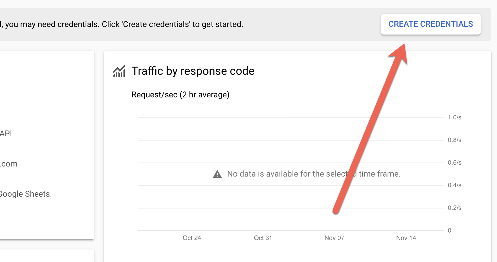
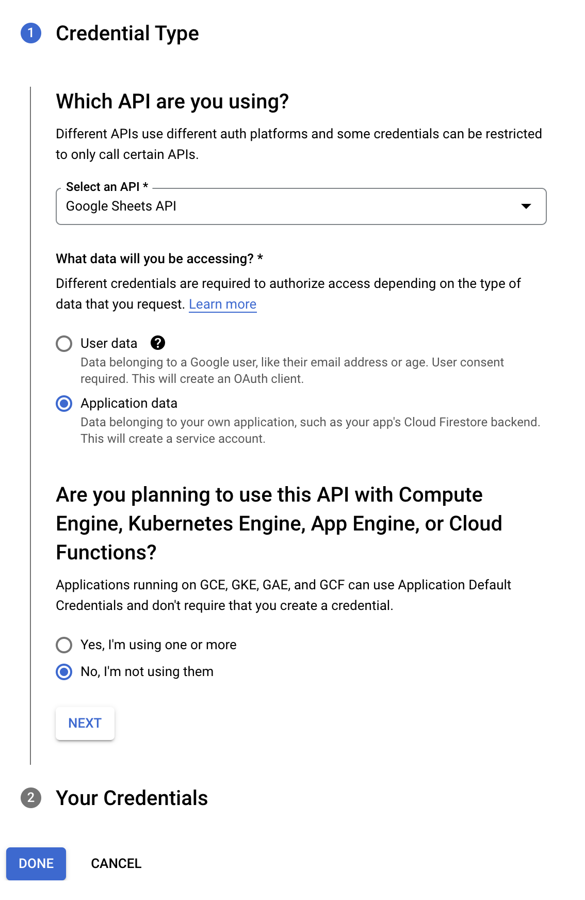
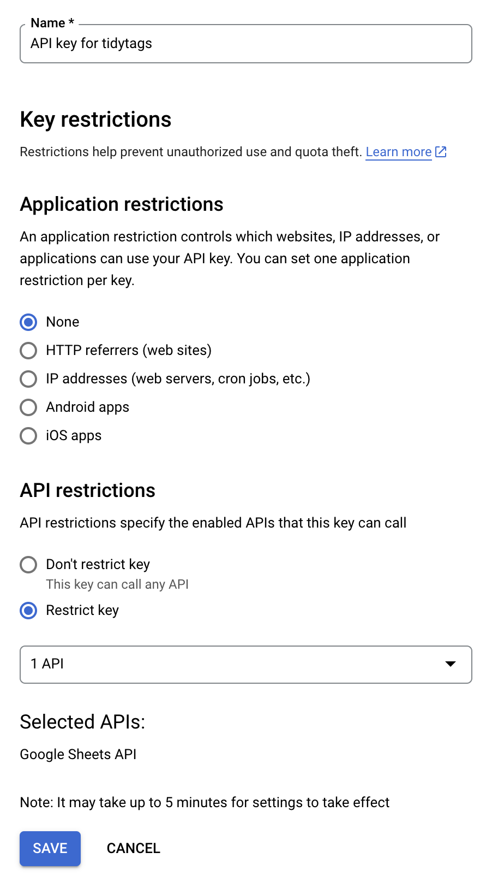

```{r setup, include=FALSE}
knitr::opts_chunk$set(
  collapse = TRUE,
  comment = "#>",
  fig.path = ".",
  out.width = "100%",
  message = FALSE,
  warning = FALSE,
  error = FALSE)
```

This vignette introduces the initial setup necessary to use {tidytags}. Specifically, this guide offers help for four key tasks.

1. Making sure your TAGS tracker can be accessed
2. Getting and storing a Google API key
3. Getting and storing Twitter API tokens
4. Getting and storing a OpenCage Geocoding API key (optional; required only for geocoding)

## Considerations Related to Ethics, Data Privacy, and Human Subjects Research 

Before reading through these steps for setting up {tidytags}, please take a few moments to **reflect on ethical considerations** related to social media research. 

```{r, child='../man/fragments/ethics.Rmd'} 
```

With these things in mind, let's get started working through some of the common pain points.

## Key Task #1. Making sure your TAGS tracker can be accessed

A core functionality of {tidytags} is collecting tweets continuously with a [Twitter Archiving Google Sheet](https://tags.hawksey.info/) (TAGS). Here we offer **a brief overview related to getting setup with TAGS**, but be sure to read through the information on  the [TAGS landing page](https://tags.hawksey.info/get-tags/) for thorough instructions on getting started with TAGS.

We recommend using **TAGS v6.1**. 

<p align="center"></p>

You will be prompted to `Make a copy` of TAGS that will then reside in your own Google Drive space. Click the button to do this.

<p align="center"></p>

Your TAGS tracker is now ready to use! Just follow the two-steps of instructions on the TAGS tracker:

<p align="center"></p>

{tidytags} is set up to access a TAGS tracker by using the [{googlesheets4} package](https://CRAN.R-project.org/package=googlesheets4). One requirement for using {googlesheets4} is that your TAGS tracker has been "published to the web." To do this, with the TAGS page open in a web browser, go to `File >> Publish to the web`. 

<p align="center"></p>

The `Link` field should be 'Entire document' and the `Embed` field should be 'Web page.' If everything looks right, then click the `Publish` button. 

<p align="center"></p>

Next, click the `Share` button in the top right corner of the Google Sheets window, select `Get shareable link`, and set the permissions to 'Anyone with the link can view.' 

<p align="center"></p>

<p align="center"></p>

The input needed for the `tidytags::read_tags()` function is either the entire URL from the top of the web browser when opened to a TAGS tracker, or a Google Sheet identifier (i.e., the alphanumeric string following "https://docs.google.com/spreadsheets/d/" in the TAGS tracker's URL). 

<p align="center"></p>

<p align="center"></p>

Be sure to put quotations marks around the URL or sheet identifier when entering it into `read_tags()` function. For example:

`read_tags("18clYlQeJOc6W5QRuSlJ6_v3snqKJImFhU42bRkM_OX8")`.

## Key Task #2. Getting and storing a Google API key

To use `read_tags()`, you will need a **Google API key** for Google Sheets. Follow the {gargle} package vignette [How to get your own API credentials](https://gargle.r-lib.org/articles/get-api-credentials.html) for a thorough guide through this process. The general steps are as follows:

1. Enable the Google Sheets API in the [Google Developers Console](https://console.developers.google.com/apis/api/sheets.googleapis.com/). To do so, from [this link](https://console.developers.google.com/apis/api/sheets.googleapis.com/), click the `CREATE CREDENTIALS` button (see the image below).

<p align="center"></p>

2. On the next screen, select Google Sheets API and check the "Application data" radio button to the first prompt, and "No, I'm not using them" button for the second, as in the following:

<p align="center"></p>

2. Next, you'll next see a screen like the one below. There, name the key with a clearly identifiable title, such as "API key for tidytags." Leave the “Application restrictions” setting as None, but under “API restrictions” select Restrict key and then check the box next to Google Sheets API. This is the only API needed for {tidytags} and will ensure that your new Google API key can only be used to access Google Sheets.

<p align="center"></p>

4. Finally, bring the Google API key into R. Specifically, add the key to the `.Renviron` file. Edit this file directly using the `usethis::edit_r_environ(scope='user')` function. The format of the `.Renviron` file should be as follows (inputting your unique Google API key after the `=` sign, with no quotation marks):

`GOOGLE_API_KEY = YourGoogleAPIKey`

Restart R (by closing and opening R/RStudio) for this key to be available in your next R Session.

You can read more about the Google Sheets API [here](https://console.developers.google.com/apis/library/sheets.googleapis.com), and get help with the API [here](https://developers.google.com/sheets/api/support).

## Key Task #3. Getting and storing Twitter API token

With a TAGS tracker archive imported into R, {tidytags} allows you to gather quite a bit more information related to the TAGS-collected tweets with the `pull_tweet_data()` function. This function builds off the [{rtweet} package](https://docs.ropensci.org/rtweet/) (via `rtweet::lookup_tweets()`) to query the Twitter API. However, **to access the Twitter API, whether through {rtweet} or {tidytags}, you will need to apply for developers' access from Twitter**. You do this [through Twitter's developer website](https://developer.twitter.com/en/apply-for-access).

### Getting access token

Fortunately, the {rtweet} documentation already contains a very thorough vignette, [Obtaining and using access tokens](https://docs.ropensci.org/rtweet/articles/auth.html), to guide you through the process of obtaining a Twitter API token. We recommend the second suggested method listed in the {rtweet} vignette, [2. Access token/secret method](https://docs.ropensci.org/rtweet/articles/auth.html#access-tokensecret-method). 

Following these directions, you will run the `rtweet::create_token()` function to save your Twitter token. saves your Twitter API key and token to the `.Renviron` file directly using the `usethis::edit_r_environ(scope='user')` function. The format of the `.Renviron` file should be as follows (inputting your unique credentials after the `=` sign, with no quotation marks):

```{r, eval=FALSE}
TWITTER_APP = NameOfYourTwitterApp
TWITTER_API_KEY = YourConsumerKey
TWITTER_API_SECRET = YourConsumerSecretKey
TWITTER_ACCESS_TOKEN = YourAccessToken
TWITTER_ACCESS_TOKEN_SECRET = YourAccessTokenSecret
```

Note that there are two separate **secrets**: `TWITTER_API_SECRET` (used to authenticate at the application level, which is most relevant when using {tidytags}) and `TWITTER_ACCESS_TOKEN_SECRET`(used to authenticate at the end-user level, which can allow access to one's own private user data).

Once you've added these Twitter API pieces to `.Renviron`, run `rtweet::create_token()` with the following parameters:

```{r, eval=FALSE}
token <- rtweet::create_token(
    app = Sys.getenv('TWITTER_APP'),
    consumer_key = Sys.getenv('TWITTER_API_KEY'),
    consumer_secret = Sys.getenv('TWITTER_API_SECRET'),
    access_token = Sys.getenv('TWITTER_ACCESS_TOKEN'),
    access_secret = Sys.getenv('TWITTER_ACCESS_TOKEN_SECRET'))
```

This compiles together all the pieces from your Twitter API credentials into one token (an .rds file) that is stored securely on your local machine. {tidytags} functions will now retrieve this token in the background, as needed. You only ever have to set this up once (until you start working on a different computer or need to change your Twitter API token).

### Authorization in future R sessions

To make sure the **Twitter API token** works, restart your R session and run the code `rtweet::get_token()`.

## Key Task #4. Getting and storing a OpenCage Geocoding API key

The {tidytags} function `geocode_tags()` pulls from the OpenCage Geocoding API, which requires a OpenCage Geocoding API key. *Note that this key task is only required for geocoding and not other functionality provided by {tidytags}*. Getting an OpenCage Geocoding API key is more straightforward and immediate than the Twitter API token process.

We switched to using OpenCage instead of the Google Maps API for several reasons (read more from OpenCage: [Migrating from Google Maps](https://opencagedata.com/guides/how-to-switch-from-google-maps-geocoding)). We were primarily motivated by working with open data and then convinced by the difference in price point. 

For comparison, geocoding queries with the Google Maps API (see [Google pricing](https://developers.google.com/maps/documentation/geocoding/usage-and-billing)) cost 0.005 USD for each search (5.00 USD per 1,000). Google gives a monthly credit of \$200, so you can conduct **40,000** location searches per month for free. In contrast, OpenCage API allows 2,500 searches per day as part of a free trial, so you can conduct up to **75,000** per month for free. Once you need to scale up your searches, OpenCage offers a \$50/month tier that allows 10,000 searches per day, or up to **300,000** in a month. In contrast, \$50 to Google would only get an additional 10,000 searches beyond the free 40,000, so \$50/month would get you up to **50,000** searches in a month through Google. The pricing gap continues to widen as you scale up further.

OpenCage does seem to be a bit flexible if the 2,500 queries per day are exceeded. However, if you greatly exceed this limit, they will send a warning and ask you to upgrade to a paid plan.

### Getting the access key 

You can secure an API access key through OpenCage directly; their Quick Start guide offers helpful guidance ([read more here](https://docs.ropensci.org/opencage/#quickstart)). Once you have the key, the [OpenCage Geocoding API Documentation](https://opencagedata.com/api) offers many more additional helps.

We recommend saving your OpenCage Geocoding API key in the `.Renviron` file as **OPENCAGE_KEY** (similar to what you did with the Twitter tokens). You can quickly access this file using the R code: 

```{r, eval=FALSE}
usethis::edit_r_environ(scope='user')
```

Then, add a line to this file that reads (inputting your unique OpenCage Key after the `=` sign, with no quotation marks): 

`OPENCAGE_KEY = PasteYourOpenCageKeyHere` 

**Once you've saved the .Renviron file, quit your R session and restart.** The function `geocode_tags()` will work for you from now on. Note that the {tidytags} `geocode_tags()` function retrieves your saved API key automatically and securely, and you won't need to think about this after the initial setup. 

### Authorization in future R sessions

To make sure the **OpenCage Geocoding API key** works, restart your R session and run the following code:

```{r, eval=FALSE}
Sys.getenv('OPENCAGE_KEY')
```

## Getting help

```{r, child='../man/fragments/getting-help.Rmd'} 
```
