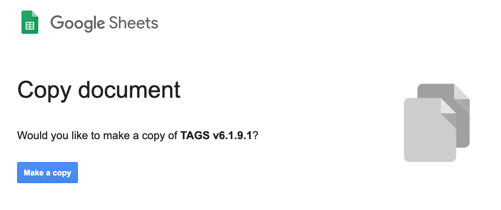
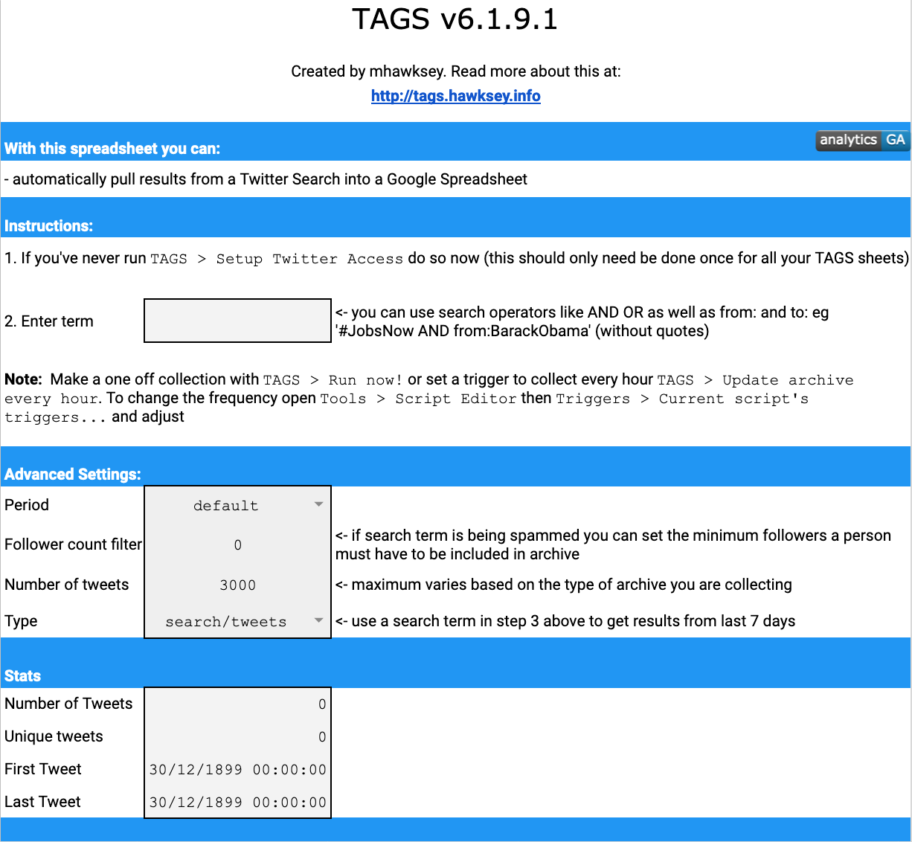
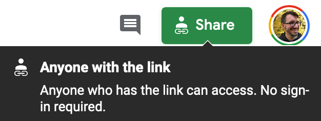
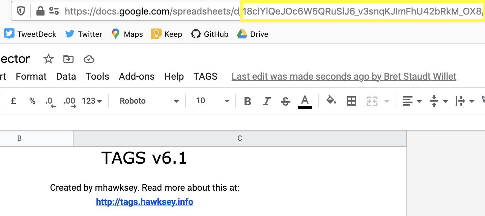
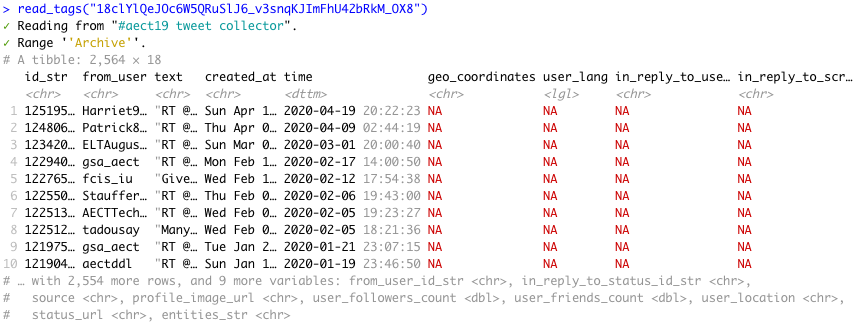

```{r setup, include=FALSE}
knitr::opts_chunk$set(
  collapse = TRUE,
  comment = "#>",
  fig.path = ".",
  out.width = "100%",
  message = FALSE,
  warning = FALSE,
  error = FALSE)
```

This vignette introduces the initial setup necessary to use **tidytags**. Specifically, this guide offers help for two key tasks.

1. Making sure your TAGS tracker can be accessed
2. Getting and storing Twitter API tokens

## Considerations Related to Ethics, Data Privacy, and Human Subjects Research 

Before reading through these steps for setting up **tidytags**, please take a few moments to **reflect on ethical considerations** related to social media research. 

```{r, child='../man/fragments/ethics.Rmd'}
```

With these things in mind, let's get started working through two key tasks.

## Key Task #1. Making sure your TAGS tracker can be accessed

A core functionality of **tidytags** is to retrieve tweets data from a [Twitter Archiving Google Sheet](https://tags.hawksey.info/); TAGS). A TAGS tracker continuously collects tweets from Twitter, based on predefined search criteria and collection frequency. 

Here we offer **a brief overview on how to set up TAGS**, but be sure to read through the information on  the [TAGS landing page](https://tags.hawksey.info/get-tags/) for thorough instructions on getting started with TAGS.

We recommend using **TAGS v6.1**. 

<p align="center"></p>

You will be prompted to `Make a copy` of TAGS that will then reside in your own Google Drive space. Click the button to do this.

<p align="center"></p>

Your TAGS tracker is now ready to use! Just follow the two-steps of instructions on the TAGS tracker:

<p align="center"></p>

**tidytags** is set up to access a TAGS tracker by using the [**googlesheets4** package](https://CRAN.R-project.org/package=googlesheets4). One requirement for using **googlesheets4** is that your TAGS tracker has been "published to the web." To do this, with the TAGS page open in a web browser, go to `File >> Share >> Publish to the web`. 

<p align="center"></p>

The `Link` field should be 'Entire document' and the `Embed` field should be 'Web page.' If everything looks right, then click the `Publish` button. 

<p align="center"></p>

Next, click the `Share` button in the top right corner of the Google Sheets window, select `Get shareable link`, and set the permissions to 'Anyone with the link can view.' 

<p align="center"></p>

<p align="center"></p>

The input needed for the `tidytags::read_tags()` function is either the entire URL from the top of the web browser when opened to a TAGS tracker, or a Google Sheet identifier (i.e., the alphanumeric string following `https://docs.google.com/spreadsheets/d/` in the TAGS tracker's URL). 

<p align="center"></p>

<p align="center"></p>

Be sure to put quotations marks around the URL or sheet identifier when entering it into `read_tags()` function.

To verify that this step worked for you, run the following code:

`read_tags("18clYlQeJOc6W5QRuSlJ6_v3snqKJImFhU42bRkM_OX8")`

What should return is the following:

<p align="center"></p>

Then, try to run `read_tags()` with your own URL or sheet identifier. If that does not work, carefully review the steps above.

## Key Task #2. Getting and storing Twitter API token

With a TAGS tracker archive imported into R, **tidytags** allows you to gather quite a bit more information related to the TAGS-collected tweets with the `pull_tweet_data()` function. This function builds off the [**rtweet** package](https://docs.ropensci.org/rtweet/) (via `rtweet::lookup_tweets()`) to query the Twitter API. However, **to access the Twitter API, whether through rtweet or tidytags, you will need to apply for developers' access from Twitter**. You do this [through Twitter's developer website](https://developer.twitter.com/en/apply-for-access).

### Getting Twitter API token

Once approved for developer's access to the Twitter API, be sure to save the keys and tokens granted to you. These will only be available to you once (but you can easily generate new ones later as needed), so save them in a secure place. 

**Never share API keys or tokens with anyone; never add these directly to your R code or output.**

One option is to save your Twitter API credentials in the **.Renviron** file accessed through the `usethis::edit_r_environ(scope='user')` function.

Your saved Twitter API key and tokens should like something like this:

```{r, eval=FALSE}
TWITTER_APP = NameOfYourTwitterApp
TWITTER_API_KEY = YourConsumerKey
TWITTER_API_SECRET = YourConsumerSecretKey
TWITTER_ACCESS_TOKEN = YourAccessToken
TWITTER_ACCESS_TOKEN_SECRET = YourAccessTokenSecret
TWITTER_BEARER_TOKEN = YourBearerToken
TWITTER_BEARER = YourBearer
```

### Setting up 

The **rtweet** documentation already contains a very thorough vignette, "Authentication with rtweet" (`vignette("auth", package = "rtweet")`), to guide you through the process of authenticating access to the Twitter API. We recommend the **app-based authentication** method that uses `auth <- rtweet::rtweet_app()`, described in the [Apps](https://docs.ropensci.org/rtweet/articles/auth.html#apps) section of the vignette.

The default for the app-based method is to enter the Twitter bearer token (what you saved as **TWITTER_BEARER_TOKEN**) interactively, when prompted.

Finally, to make sure the authentication works properly, run the code `rtweet::get_token()`.

## Start using tidytags

After completing these two key task, you're now ready to start using **tidytags**! 

Now would be a good time to learn about the full functionality of the package by walking through the "Using tidytags with a conference hashtag" guide (`vignette("tidytags-with-conf-hashtags", package = "tidytags")`).

## Getting help

```{r, child='../man/fragments/getting-help.Rmd'} 
```
